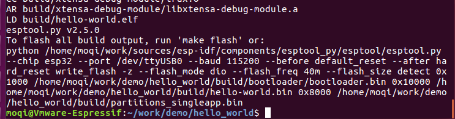

***************
ESP32
***************

环境搭建
=========================================================================

	我用的环境是 ubuntu16.04 64位

1.1 安装依赖软件
-------------------------------------------------------------------------

.. code:: bash

	sudo apt-get install gcc git wget make libncurses-dev flex bison gperf python python-serial python-pip

1.2 获取源码
-------------------------------------------------------------------------

先创建一个文件夹存放源码

.. code:: bash

	mkdir -p ~/work/sources
	cd ~/work/sources

下载源码

.. code:: bash

	git clone --recursive https://github.com/espressif/esp-idf.git

.. note::

    注意这里有个 ``--recursive`` 选项。如果你克隆 ESP-IDF 时没有带这个选项，你还需要运行额外的命令来获取子模块： ::

        cd ~/work/sources
        git submodule update --init

设置环境变量

.. code:: bash

	echo export IDF_PATH="~/work/sources/esp-idf" >> ~/.bashrc
	source ~/.bashrc
	

1.3 安装交叉编译链
-------------------------------------------------------------------------

	创建一个文件夹来存放交叉编译链

.. code:: bash

	mkdir -p ~/work/tool
	cd ~/work/tool

- 32位 Linux系统:

.. code:: bash

	wget https://dl.espressif.com/dl/xtensa-esp32-elf-linux32-1.22.0-80-g6c4433a-5.2.0.tar.gz

- 64位 Linux系统:

.. code:: bash

	wget https://dl.espressif.com/dl/xtensa-esp32-elf-linux64-1.22.0-80-g6c4433a-5.2.0.tar.gz

解压到opt文件夹下

.. code:: bash

	sudo tar -xvf xtensa-esp32-elf-linux64-1.22.0-80-g6c4433a-5.2.0.tar.gz -C /opt/

设置环境变量

.. code:: bash

	echo export PATH="$PATH:/opt/xtensa-esp32-elf/bin" >> ~/.bashrc
	source ~/.bashrc

检验交叉链是否成功安装

.. code:: bash

	xtensa-esp32-elf-gcc -v

如果输出

.. figure:: ./_static/xtensa_gcc_output.png
    :align: center
    :figclass: align-center

则已经安装成功

安装依赖的 Python 软件包

.. code:: bash

	python -m pip install --user -r $IDF_PATH/requirements.txt

1.4 创建一个工程
-------------------------------------------------------------------------

到这里就可以开始开发ESP32了, 根据国际惯例, 我们先写一个Hello world的程序

还是要先创建一个工程放置源代码

.. code:: bash

	mkdir -p ~/work/demo

在ESP-idf里面有一个文件夹examples存放着ESP32的相关例程, 

现在我们将get-started下的hello_world复制到我们的文件夹下

.. code:: bash

	cp -rf ~/work/sources/esp-idf/examples/get-started/hello_world/ ~/work/demo/
	cd ~/work/demo/hello_world/

编译程序

.. code:: bash

	make all

如果输出这个, 则证明环境安装成功

接下来, 我们把目标板接到电脑, 将程序下载到开发板中, ESP32是支持直接在linux环境下下载程序, 但是在此之前得先修改下串口的权限

.. code:: bash

	sudo usermod -a -G dialout $USER
	reboot

输入完指令以后电脑会重启, 然后我们就可以下载程序了

.. code:: bash

	cd ~/work/demo/hello_world/
	make flash

.. note::

	如果在这里没有成功下载, 那有可能是你的串口号不对, 你可以使用 make menuconfig 来修改串口号, 在命令行输入make menuconfig, 然后根据提示选择以下选项, 然后就可以更改串口号了 ::

		Serial flasher config  --->
		(/dev/ttyUSB0) Default serial port

到这里, 你的ESP32的调试串口就会有Hello world输出了, 你可以使用串口调试工具来查看

深入开发
=========================================================================

2.1 建立一个空的工程
-------------------------------------------------------------------------

我们先进入我们之前建立的demo文件夹, 然后创建一个新的文件夹来存放我们的工程

.. code:: bash

    cd ~/work/demo/
    mkdir lesson1_empty_project/
    cd lesson1_empty_project/

我们首先需要一个Makefile文件,熟悉linux下编程的人就知道,Makefile是用来管理工程用的

.. code:: bash

    touch Makefile

接下来在Makefile文件下输入以下内容

.. code:: bash

    PROJECT_NAME := lesson-1
    include $(IDF_PATH)/make/project.mk

第一行代码的意思是输入你这个工程的名字,第二行的代码是帮你链接ESP-idf的工程文件,ESP-idf已经帮你把ESP32的驱动文件写好了,我们仅需要调用他的Api就可以, 接下来我们创建一个主文件夹来存放我们的工程代码

.. code:: bash

    mkdir main
    cd main
    touch component.mk
    touch main.c

接下来在main.c输入以下内容

.. code:: bash

    #include <stdio.h>
    #include "freertos/FreeRTOS.h"
    #include "freertos/task.h"
    #include "esp_system.h"

    void app_main()
    {
        while (1)
        {
            printf ("Hell World\n");
            vTaskDelay(1000 / portTICK_PERIOD_MS);
        }
    }

到这里整个工程就已经成功搭建完毕, 已经可以像1.4节一样编译并下载到我们的ESP32的开发板里面去。你们也可以直接到我的github里下载完整的工程, 以后别的工程我也会直接推送到github。

.. code:: bash

    https://github.com/moqi-smile/ESP32-Project.git

2.2 点亮一个led
-------------------------------------------------------------------------

2.3 串口回调函数
-------------------------------------------------------------------------

2.4 让你的ESP32连接上你的路由器(wifi)
-------------------------------------------------------------------------

2.5 让你的ESP32连接上你的路由器(网线)
-------------------------------------------------------------------------

2.6 

